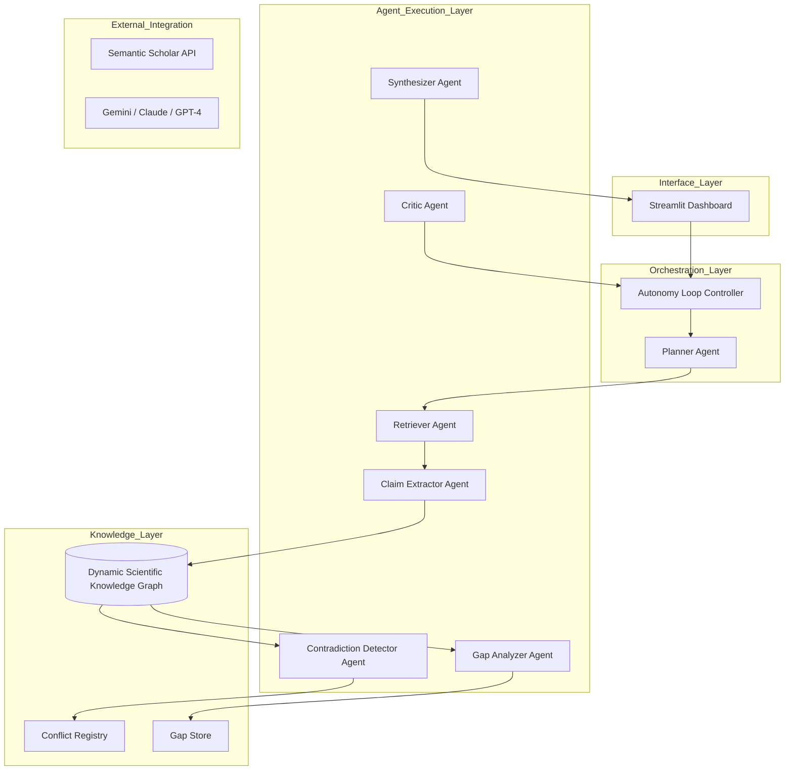

# Uncertainty-Aware Scientific Claim Synthesis
### A Multi-Agent Framework for Contradiction Detection, Gap Formalization, and Confidence-Grounded Literature Review Generation

[](https://opensource.org/licenses/MIT)
[](https://www.python.org/downloads/release/python-3110/)
[](https://github.com/langchain-ai/langgraph)

---

## 🔬 Project Overview

This Research and Development project addresses the fundamental challenges of scientific knowledge synthesis in an era of exponential publication growth. Traditional automated survey systems often produce ungrounded summaries that ignore inter-paper contradictions and offer vague research gap claims. 

Our framework introduces an **autonomous multi-agent architecture** that treats scientific literature as a structured relational knowledge base rather than a flat collection of text. It systematically extracts claims, detects conflicting findings, and formalizes research gaps as verifiable objects.

### 🎯 Key R&D Objectives
1.  **Epistemic Grounding**: Assigning calibrated confidence scores to scientific claims based on consensus and recency.
2.  **Conflict Resolution**: Identifying and classifying methodological, temporal, and definitional contradictions across papers.
3.  **Gap Formalization**: Generating structured, falsifiable research gap objects grounded in structural evidence from a Knowledge Graph.
4.  **Temporal Awareness**: Tracking the diachronic trajectory of research threads to model the evolution of scientific consensus.

---

## 🏗️ System Architecture

The system is built on a modular, five-layer architecture designed for scalability and reasoning transparency.



---

## 🚀 Core Technical Contributions

### 1. Confidence-Graded Claim Extraction (CGCERS)
Extracts atomic scientific claims and assigns a reliability score ($S_c$) based on:
$$S_c = \alpha \cdot Consensus(c) + \beta \cdot Recency(c) - \gamma \cdot Contradiction(c)$$
*   **Consensus**: Multi-paper agreement within the DSKG.
*   **Recency**: Time-decay weighted evidence favoring modern findings.
*   **Contradiction**: Presence of conflicting evidence flagged by the CDRA.

### 2. Contradiction Detection & Resolution Agent (CDRA)
Utilizes a four-dimensional conflict taxonomy to categorize disagreements:
*   **Methodological**: Discrepancies due to experimental setups.
*   **Domain-Specificity**: Findings that vary across application domains.
*   **Temporal**: Superseded or refined findings over time.
*   **Definitional**: Conflicts arising from differing terminology.

### 3. Formalized Research Gap Ontology (FRGO)
Gaps are no longer just sentences; they are **structured objects** featuring:
*   **Gap Type**: (e.g., Unexplored Intersection, Contradictory State).
*   **Evidence Type**: Grounded in specific paper clusters.
*   **Falsifiability Statement**: Explicit criteria for what would fill the gap.

### 4. Dynamic Scientific Knowledge Graph (DSKG)
A heterogeneous graph (Neo4j/NetworkX) replacing flat vector stores. 
*   **Nodes**: Concepts, Methods, Claims, Findings.
*   **Edges**: `supports`, `contradicts`, `extends`, `qualifies`.

---

## 📊 Evaluation Metrics

The framework is evaluated using five novel R&D metrics:

| Metric | Full Name | Description |
| :--- | :--- | :--- |
| **CCS** | Claim Coverage Score | Ratio of extracted core claims to expert-identified gold standards. |
| **CD-F1** | Contradiction Detection F1 | Precision and Recall of the system in identifying genuine conflicts. |
| **GP@K** | Gap Precision at K | Percentage of top-K gaps validated by future publications. |
| **TCS** | Temporal Coherence Score | Accuracy of the modeled diachronic trajectory of research threads. |
| **CalibScore** | Calibration Score | Alignment between system confidence and expert consensus. |

---

## 📂 Project Scaffolding

```text
Gen_R-D_Project/
├── src/
│   ├── agents/            # Specialized agents (Claim, Conflict, Gap, etc.)
│   ├── orchestration/     # LangGraph autonomy loop logic
│   ├── models/            # Pydantic data models for claims, gaps, and state
│   ├── knowledge_graph/   # DSKG construction and traversal algorithms
│   ├── retrieval/         # Academic API integrations (ArXiv, S2)
│   ├── stores/            # Persistence for claims, conflicts, and gaps
│   ├── evaluation/        # Quantitative metric computation logic
│   └── utils/             # Prompts and system helpers
├── data/                  # Local storage for papers and logs
├── app.py                 # Streamlit UI Dashboard
├── run.py                 # CLI Entry point
├── Dockerfile             # Containerization config
└── requirements.txt       # Dependency management
```

---

## 🛠️ Tech Stack

*   **Logic**: Python 3.11, LangGraph, LangChain
*   **LLMs**: Gemini 1.5 Pro/Flash, Claude 3.5 Sonnet, GPT-4o
*   **Knowledge Graph**: Neo4j, NetworkX
*   **Vector Search**: ChromaDB / pgvector
*   **UI**: Streamlit, Plotly (Radar charts), PyVis (Graph visualization)
*   **Processing**: PyMuPDF, GROBID

---

## 🏃 Getting Started

### 1. Environment Setup
```bash
# Clone the repository
git clone https://github.com/Mubeen-Baloch/Gen_R-D_Project.git
cd Gen_R-D_Project

# Create and activate conda environment
conda create -n dotasim python=3.11
conda activate dotasim

# Install dependencies
pip install -r requirements.txt
```

### 2. Configuration
Create a `.env` file in the root directory:
```env
GOOGLE_API_KEY=your_key_here
LLM_PROVIDER=google
LLM_MODEL=gemini-1.5-flash
```

### 3. Running the UI
```bash
streamlit run app.py
```

---

## 📜 Acknowledgments
This work is part of an ongoing R&D effort to advance semi-autonomous scientific reasoning and synthesis.
